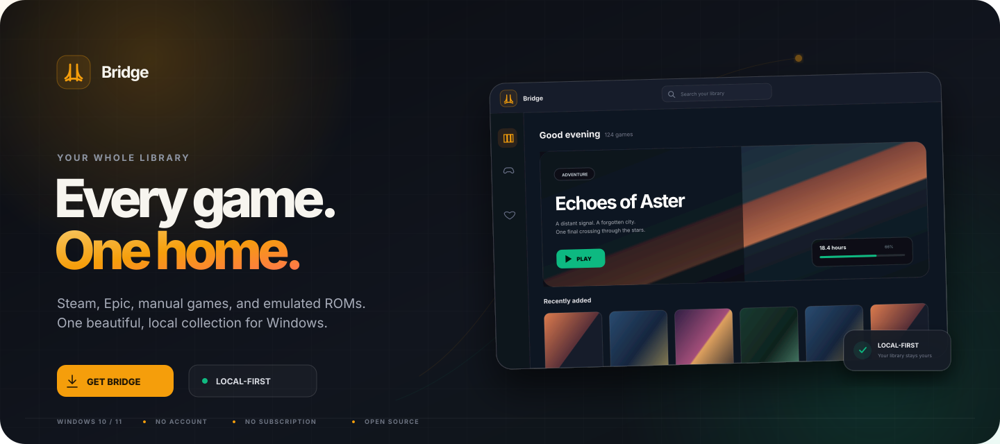
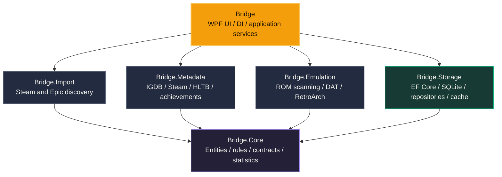

<div align="center">

<a href="https://zavalasebas.github.io/Bridge/">
  
</a>

<br>

[](https://github.com/ZavalaSebas/Bridge/releases/latest)
[](https://github.com/ZavalaSebas/Bridge/actions/workflows/release.yml)
[](https://github.com/ZavalaSebas/Bridge/releases/latest)
[](LICENSE)

**A local-first game library for Windows.** Bring Steam, Epic, manual games, and emulated ROMs into one collection that feels like yours.

[**Download Bridge**](https://github.com/ZavalaSebas/Bridge/releases/latest)
&nbsp;&nbsp;&middot;&nbsp;&nbsp;
[Website](https://zavalasebas.github.io/Bridge/)
&nbsp;&nbsp;&middot;&nbsp;&nbsp;
[Documentation](DEVELOPMENT.md)
&nbsp;&nbsp;&middot;&nbsp;&nbsp;
[Contribute](CONTRIBUTING.md)

</div>

<br>

> [!IMPORTANT]
> Bridge is under active development. Back up a library you care about before testing a new release.

## The library between you and every game

Launchers know what they installed. Folders know where files live. Emulators know how to run a ROM.

**Bridge knows the collection.**

It brings those disconnected pieces into one searchable, customizable catalog without asking for another account, another subscription, or a runtime full of plugins. Metadata and artwork are cached locally, imports only update what changed, and the packaged app runs as a self-contained Windows executable.

<table>
  <tr>
    <td width="50%" valign="top">
      <h3>One shelf for everything</h3>
      Steam, Epic, standalone executables, and ROMs share the same search, filters, artwork, favorites, and play history.
    </td>
    <td width="50%" valign="top">
      <h3>Your collection stays yours</h3>
      The database, preferences, and artwork cache live on your PC. Back them up or restore them whenever you want.
    </td>
  </tr>
  <tr>
    <td width="50%" valign="top">
      <h3>Details without the chores</h3>
      IGDB, Steam, SteamGridDB, and How Long to Beat turn sparse imports into rich game pages with covers, heroes, screenshots, and context.
    </td>
    <td width="50%" valign="top">
      <h3>Old worlds, modern doorway</h3>
      Scan ROM folders and let Bridge prepare its managed RetroArch frontend and the right core when you first press Play.
    </td>
  </tr>
</table>

<div align="center">
  <sub>NO NEW ACCOUNT &nbsp;&bull;&nbsp; NO SUBSCRIPTION &nbsp;&bull;&nbsp; NO PLUGIN SCAVENGER HUNT &nbsp;&bull;&nbsp; NO LIBRARY LOCK-IN</sub>
</div>

---

## What Bridge feels like

### Browse the way the moment calls for

| **Covers** | **List** | **Table** |
|:---:|:---:|:---:|
| A visual wall for rediscovery | Fast browsing with an expandable detail panel | Dense metadata when you want the full picture |

Search, favorites, install status, sorting, grouping, and detail filters stay consistent across every view.

### Press Play, not Configure

- **Steam and Epic detection** reads the launchers' local manifests and imports installed games automatically.
- **Manual discovery** scans shortcuts, folders, or a single executable while filtering common installers and helpers.
- **ROM discovery** recognizes supported systems, reads archives, enriches titles, and watches saved folders for new games.
- **Unified launching** starts each game through its native action and tracks playtime across sessions.
- **Managed emulation** downloads or updates Bridge's RetroArch setup and required core on first use.

### Give every game a proper place

- **Metadata that layers intelligently** across Bridge's IGDB service, public/user IGDB providers, and Steam Store fallback.
- **Artwork with intent** through SteamGridDB, web image search, local files, and persistent custom hero choices.
- **A cinematic detail view** with screenshots, links, scores, genres, studios, release data, and How Long to Beat progress.
- **Achievements in the library** for Steam, Epic, and supported ROMs through RetroAchievements.
- **A library that remembers** favorites, sessions, playtime, recently played games, completion context, and statistics.

### Make the room yours

- Runtime accent colors and a custom color picker.
- Optional translucent sidebar and blurred game artwork.
- Sidebar position and visibility controls.
- Reorderable detail sections, Covers compact vs full-details layout, and persistent view preferences.
- English and Spanish interface.

<details>
<summary><strong>See the complete feature inventory</strong></summary>

#### Library

- Incremental Steam and Epic import with locally resolved icons.
- Manual entries with dedicated editing for names, actions, genres, developers, publishers, platforms, and media.
- Search plus presets for All, Favorites, Installed, Not Played, and Recently Played.
- Sorting and grouping across names, playtime, activity, scores, studios, platforms, sources, install size, release year, and more.
- Hidden games, favorites, watched scan folders, refresh-on-demand, and automatic startup sync.

#### Game details

- Covers, icons, hero backgrounds, descriptions, genres, developers, publishers, release dates, scores, links, and screenshots.
- Clickable metadata values that become active library filters.
- How Long to Beat estimates compared with real playtime.
- SteamGridDB browser and picker with live previews.
- Cinematic screenshot carousel with thumbnails, keyboard navigation, expansion, and auto-advance.
- Default, black, or custom hero backgrounds preserved across metadata refreshes.

#### Emulation and achievements

- Recursive ROM scanning, including `.zip` and `.7z` archives.
- NES, SNES, N64, GB/GBC/GBA, NDS, Genesis, Master System, Game Gear, Atari, PC Engine, Lynx, and WonderSwan detection.
- No-Intro DAT matching for cleaner ROM identities.
- Bridge-managed RetroArch and per-system core setup.
- Optional RetroArch cheats from `libretro-database`.
- Steam, Epic, and RetroAchievements progress in the game detail panel.

#### Application

- First-run profile and source setup.
- Self-updater with database backup, safe executable swap, and automatic schema migrations.
- Unified Settings hub, beta update channel, system tray, and optional Windows startup.
- Covers compact info panel or full details at half width.
- Library backup and restore for the database, preferences, and artwork cache.
- Localized English and Spanish UI.
- What's New notes after an update.

</details>

---

## Start in under a minute

### Download the app

1. Open [**GitHub Releases**](https://github.com/ZavalaSebas/Bridge/releases/latest).
2. Download `Bridge.exe`.
3. Run it and follow the source setup.

The release is self-contained. **You do not need to install .NET.**

| Requirement | Release build | Build from source |
|---|:---:|:---:|
| Windows 10 or 11 | Required | Required |
| .NET runtime | Not required | - |
| .NET 10 SDK | - | Required |
| Existing Steam/Epic install | Optional | Optional |
| Your own emulators and ROMs | Optional | Optional |

> [!NOTE]
> Windows may show a SmartScreen warning for an unsigned build. Review the release, verify its source here, and only continue if you trust the download.

### Build it yourself

```powershell
git clone https://github.com/ZavalaSebas/Bridge.git
cd Bridge
dotnet publish Bridge/Bridge.csproj -c Release -r win-x64 --self-contained true -p:PublishSingleFile=true -o ./publish
```

Your executable will be at `publish\Bridge.exe`.

---

## Architecture

Bridge is a **modular monolith**. Project references enforce the boundaries: the domain knows nothing about infrastructure, use-case modules stay persistence-agnostic, and the WPF application composes the system.



| Layer | Responsibility |
|---|---|
| [`Bridge.Core/`](Bridge.Core/) | Domain entities, contracts, filters, rules, and statistics |
| [`Bridge.Storage/`](Bridge.Storage/) | SQLite persistence, EF Core repositories, migrations, and local caches |
| [`Bridge.Import/`](Bridge.Import/) | Pure Steam and Epic library discovery |
| [`Bridge.Metadata/`](Bridge.Metadata/) | Metadata, artwork, playtime estimates, and achievement providers |
| [`Bridge.Emulation/`](Bridge.Emulation/) | ROM scanning, DAT matching, RetroArch management, and cheats |
| [`Bridge/`](Bridge/) | WPF UI, dependency injection, launch orchestration, settings, and updates |
| [`Bridge.Tests/`](Bridge.Tests/) | Unit and opt-in live integration tests |

Read the decisions behind the boundaries in [**ARCHITECTURE.md**](ARCHITECTURE.md).

---

## Work on Bridge

```powershell
# Restore
dotnet restore Bridge.slnx

# Build
dotnet build Bridge.slnx -c Release --no-restore

# Run the normal test suite
dotnet test Bridge.slnx -c Release --filter "Category!=Integration"
```

Live-network provider tests are intentionally excluded from the normal suite. See the [testing guide](DEVELOPMENT.md#tests) before running integration tests.

### Find your way around

| If you want to... | Start here |
|---|---|
| Understand setup, builds, tests, migrations, and releases | [Development guide](DEVELOPMENT.md) |
| Understand why the system is shaped this way | [Architecture decisions](ARCHITECTURE.md) |
| See what changed between releases | [Changelog](CHANGELOG.md) |
| Propose or implement a change | [Contributing guide](CONTRIBUTING.md) |
| Track current scope and future work | [Project plan](PLAN.md) |
| Deploy the zero-config IGDB backend | [IGDB Worker guide](Bridge.Infra/igdb-proxy-worker/README.md) |

Contributions are welcome. Please open an issue before beginning a large behavioral or architectural change so the direction can be discussed first.

---

## Project position

Bridge was first conceived after studying unified game library managers, with [Playnite](https://playnite.link/) as the original inspiration for the idea of one local catalog. Bridge is an independent project with its own code, architecture, interface, and intentionally smaller plugin-free scope.

> [!CAUTION]
> Bridge is not affiliated with or endorsed by Playnite, Valve/Steam, Epic Games, GOG, RetroArch, or any platform, storefront, metadata provider, or emulator referenced here. Bridge does not bypass DRM and does not provide copyrighted game files. It organizes games, emulators, and ROMs that you already have.

---

## Support the project

If Bridge earns a permanent place on your desktop, you can help fund its development:

<div align="center">

[](https://github.com/sponsors/ZavalaSebas)
[](https://ko-fi.com/sebastianzavala82573)

</div>

---

<div align="center">

Released under the [GNU GPL v3.0](LICENSE)

Built with care by [ZavalaSebas](https://github.com/ZavalaSebas) and the Bridge contributors.

<sub>Your games. Your machine. Your collection.</sub>

</div>
